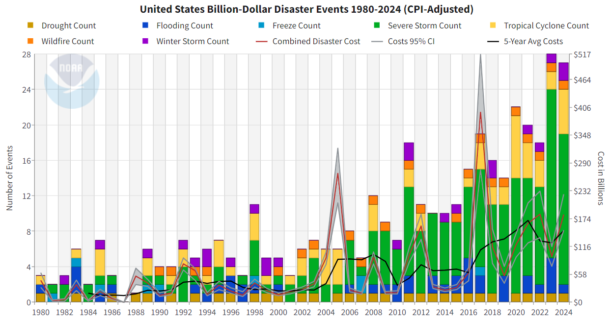

```{r}
#| label: setup
#| include: false

knitr::opts_chunk$set(
    warning = FALSE,
    message = FALSE,
    fig.path = "figs/",
    fig.width = 7.252,
    fig.height = 4,
    comment = "#>",
    fig.retina = 3
)
```

## Before your start the assignment

- Update the header - put your name in the `author` argument and put today's date in the `date` argument.
- Click the "Render" button in RStudio and then open the rendered `2-hw2.html` page.
- Then go back and try changing the `theme` argument in the header to something else - you can see other available themes [here](https://quarto.org/docs/output-formats/html-themes.html). Notice the difference when you render now!

## Overview of HW2

Create a data visualization that helps answer the question:

> **How have the number and cost of billion-dollar disasters in the US changed over time?**

You will use the NOAA Billion-Dollar Disaster dataset to explore how visual encoding choices (e.g., color, position, length) help communicate trends clearly and effectively.


**Skills practiced**:

- Downloading and importing real-world data from a public source (NOAA)
- Wrangle and explore a real-world dataset using tidyverse
- Identify appropriate visual encodings based on variable types and goals
- Create a clear and effective time-series visualization with ggplot2
- Apply design principles (titles, colors, themes, alt text) for accessibility and clarity


### Load Required Packages

```{r}
library(tidyverse)
library(janitor)
# load other packages as you see fit but remember to add comments to explain what each package does
```


## Q1: Prepare the data

Following these steps to download and read in the dataset:

1. Download the dataset from [NOAA](https://www.ncei.noaa.gov/access/metadata/landing-page/bin/iso?id=gov.noaa.nodc:0209268). Under "Access" tab, choose the HTTPS option to download the data. Scroll to the bottom of the list to download the **most recent published version**. Read more about the dataset [here](https://www.ncei.noaa.gov/access/billions/).

2. Place the downloaded CSV file `events-US-1980-2024-Q4.csv` into your `data/` folder in your HW repository. You will notice there is a graph that comes with the data, we will circle back to it later.

3. Add your data/ folder to .gitignore to avoid pushing data to GitHub.

4. Read in the CSV file using `read_csv()`

```{r}
# remove the eval=FALSE when you render quarto document
df_disasters <- read_csv("/Users/meganliu/Documents/MPH/Summer 2026/PH 6199/Homeworks/Homework 2/2026-hw2-meganyliu/data:/events-US-1980-2024-Q4.csv", skip = 2) |>
  janitor::clean_names()
# the skip argument is used to skip the first two rows of the CSV file, which contain metadata about the dataset.
```

5. Skim through the dataset to get familiar with the variable names, especially:

- `disaster`: the type of disaster (e.g., flood, drought, etc.)
- `begin_date`: the date when the disaster began
- `end_date`: the date when the disaster ended
- `cpi_adjusted_cost`: the total damages caused by the disaster (in billions of dollars)
- `deaths`: the number of deaths caused by the disaster

6. Create a new column `year` that extracts the year from the `begin_date` column. You can use the `lubridate` package to do this.

```{r}
# remove the eval=FALSE when you render quarto document
df_disasters <- df_disasters |>
  mutate(year = lubridate::year(ymd(begin_date)))
```

7. Explore the dataset and answer these questions:

- Are there any missing or zero values in the cost or deaths columns? How might they affect your visualizations?
- What are the top 5 most common disaster types?
- Calculate the total CPI-adjusted cost of disasters per year. Identify the top 3 most expensive years.

```{r}
glimpse(df_disasters)
summary(df_disasters)

df_disasters %>% 
  group_by(disaster) %>% 
  summarise(count = n()) %>% # summarize the number of disasters
  ggplot(aes(x = fct_reorder(disaster, -count), y = count)) + # reorder in descending order for easy visualization
  geom_col() + # Create bar graph using geom_col()
  geom_text(aes(label = count, vjust = -0.5)) +
  scale_y_continuous(limits = c(0, 225)) + # increase y-axis limits so that bar count labels are visible
  labs(title = "US Disaster Types, 1980-2024", x = "Disaster Type", y = "Count") +
  theme_minimal()  

df_disasters %>% # find most expensive disasters by year, by grouping by year 
  group_by(year) %>% 
  summarize(total_cpicost = sum(cpi_adjusted_cost, na.rm = TRUE)) %>% # then add up costs by year
  arrange(desc(total_cpicost)) # and display in descending order to answer the question

sum(df_disasters$cpi_adjusted_cost) # Checked the total sum of costs; above says the unit is billions of dollars, but total comes out to 2916862, so should be in millions as $2,916,862 million would equate to $2.9 trillion, which is how much the NOAA dataset overview webpage states that the disaster costs amounted to between 1980 to 2024.
```

::: {.callout-note title="Your Answer"}
- Missing data: There doesn't appear to be missing values, but there are zero values in the cost or deaths columns. This may result in making it look like some disasters didn't result in any costs or deaths, even though this most likely means that data wasn't available or collected. This may result in data visualizations (e.g. a line graph) where year is on the x-axis and deaths or costs on the y-axis having trends close to 0, making it hard to understand the true relationship between disaster types and outcomes like deaths or disaster costs; or, having more variation in the data/trend than one may expect.
- 5 most disaster types: The 5 most common disaster types were (1) Severe Storm, which occurred 203 times between 1980 to 2024; (2) Tropical Cyclone, which occurred 67 times between 1980 to 2024; (3) Flooding, which occurred 45 times; (4) Drought, which occurred 32 times; and (5) Winter Storm, which occurred 24 times.
- 3 most expensive years by CPI-adjusted cost: The 3 most expensive years by CPI-adjusted cost were (1) 2017, at $395,936.20 million; (2) 2005, at $268,593.30 million; and (3) 2022, at $188,352.90 million.
:::


## Q2: Build your visualization

Create a data visualization that summarizes trends over time (year or decade) in the frequency and/or cost of disasters.

Your final visualization should:

- Use data from 1980 to 2024 only

- Include a title (short, descriptive), subtitle (main takeaway), caption (e.g., “Data: NOAA Billion-Dollar Disasters (accessed 2025)”)

- Apply strategies for highlighting patterns or trends (e.g., highlighting recent years, distinguishing types of disasters)

- Use custom colors rather than ggplot defaults

- Use a clean, polished theme

- Include at least one theme adjustments (e.g., axis labels, legend position, font size) to improve readability/visual appeal

```{r}

# Goal is to present a table that shows trends in annual disaster costs per year in billions of dollars. To do so, will need to summarize total cpi_adjusted_cost by year, and adjust the cpi_adjusted_cost column to show values in billions, not millions (as it currently is).

df_disasters2 <- df_disasters %>% # Create new dataframe in order to graph annual disaster costs
  select(disaster, year, cpi_adjusted_cost) %>% # Select for the 3 relevant columns
  mutate(cpi_adjusted_cost_mil = (cpi_adjusted_cost/1000)) # Add new column where cost unit updated to billions

sum(df_disasters2$cpi_adjusted_cost_mil) # Check that values add up to $2.9 trillion

df_disasters2 %>% 
  ggplot(aes(x = year, y = cpi_adjusted_cost_mil, group = disaster, color = disaster)) +
  geom_line() + # Show data using a line graph
  labs(title = "Annual US Disaster Costs, 1980-2024", x = "Year", y = "Cost in Billions of Dollars", 
       subtitle = "Costs of US disasters between 1980 to 2024 amounted to $2.9 trillion", 
       caption = "Data: NOAA Billion-Dollar Disasters\n(accessed June 2026)") + # Displayed caption on two lines, since otherwise its placement was crowding the x-axis title
  facet_wrap(~ disaster) + # Faceted/distinguished by disasters, so that graph would be easier to read
  scale_color_manual(values = c( # Experimented with different colors (looked up a ggplot color chart online)
    "Drought" = "sienna4",
    "Flooding" = "dodgerblue4",
    "Freeze" = "darkorchid3",
    "Severe Storm" = "mediumvioletred",
    "Tropical Cyclone" = "springgreen4", 
    "Wildfire" = "orange2",
    "Winter Storm" = "steelblue2")) +
  theme_minimal() +
  theme(legend.position = "none") # Deleted legend, since facet_wrap() already separates and distinguishes the disaster types

```

What do you notice about the trends over time in the frequency and/or cost of disasters? Anything unexpected?

::: {.callout-note title="Your Answer"}
I chose to visualize trends in cost of disasters between 1980 to 2024, by using line graphs and faceting by disasters so that each trend was easier to interpret. Over time, it appears that most of the seven disaster types (drought, flooding, freeze, severe storm, wildfire, and winter storm) tend to range up to around $25 billion to $50 billion. While these seven can range up to these amounts, most appear to amount to costs on the lower side, closer to 0 (although lower doesn't necessarily mean inexpensive, considering the units are in billions of dollars). Tropical cyclones on the other hand appear to be the most costly disaster type, with costs peaking up to $200 billion around 2005, with additional peaks between 2010 to 2024. It appears that there have been more costly damages from tropical cyclones between around 2005 up to 2024, compared to years prior to 2005. The costs of freeze and severe storm events both seem similarly stagnant, while drought, wildfire, and winter storm events are also stagnant but both exhibit peaks in data indicating rare occurrences of perhaps more damaging and costly disasters. For both wildfires and winter storms, their highest costs both appear to have occurred more recently, around 2020, which may indicate that some of these disaster impacts may be getting worse over time.

In terms of anything unexpected, I had hypothesized that flooding costs would be high, and possibly peaking around Hurricane Katrina in 2005, or Hurricane Sandy in 2012, but based on the trends seen in the tropical cyclone graph, I'm guessing floods from hurricanes were lumped in to the tropical cyclone cost impacts, since perhaps NOAA attributes all costs and damages with the primary disaster event. I also expected that wildfire costs may be higher, given the increase in wildfire events over time, and was surprised to only see a few peaks around 2020.
:::

## Q3: Reflection

a. What are your variables of interest and what kinds of data (e.g., numeric, categorical, ordered, etc.) are they?

::: {.callout-note title="Your Answer"}
My variables of interest in this visualization were disaster types (nominal categorical data), CPI-adjusted-costs (continuous numerical), and year (discrete numerical). 
:::

b. How did you decide which type of graphic form was best suited for answering the question?
What alternative graphic forms could you have used instead? Why did you settle on this particular form?

::: {.callout-note title="Your Answer"}
I chose to use a line graph in order to show trends in disaster costs over time. I thought this would be the best visualization to see how costs have changed over time. The first graph I made lumped all the disaster types onto one graph, which made visualization difficult, so I ultimately decided to facet wrap the graph by disaster types for better visualization.

I had also considered using a stacked area chart, since I thought it could be interesting to see and compare the proportions of how much each disaster type cost the US. I had given this a try, but this  felt more difficult to interpret. 
:::

c. What modifications did you make to this viz to improve readability and accessibility?

::: {.callout-note title="Your Answer"}
For this visualization, I made sure to include a succinct but descriptive title, axis labels, a subtitle, and caption. I had initially played around with moving the caption placement using theme(plot.caption = element_text(hjust = x)), since it was initially placed directly under the x-axis label, but ultimately didn't need to do this after deleting the legend, which resulted in the caption defaulting to a more clean placement on the graph. I deleted the legend, since it felt redundant to have given that I chose to facet wrap the graph by each disaster type, where each graph had a title for their respective disaster type. I also chose different colors for each disaster type to experiment with options other than the ggplot default, by using the scale_color_manual() function.
:::

d. Is there anything you wanted to implement but didn’t know how? If so, describe it.

::: {.callout-note title="Your Answer"}
One particular element I wanted to explore but didn't know how to was whether there was a way to stretch out the x-axis. For example, some of the peaks in the tropical cyclone graph can be hard to read, and when I had initially created just the one graph with all the trend lines, the compressed dimensions made it look like some of the data peaks were obscuring other falls and rises in the data. I was wondering if stretching out the x-axis or maybe changing the dimensions of the graph would help for better visualization here.
:::

## Q4: Critique the original graph from NOAA



This plot appears on NOAA’s official Billion-Dollar Disaster website and summarizes annual disaster frequency and cost.

a. Describe the graphic

- What type(s) of chart(s) are used?
- What variables are encoded? How are they mapped to visual channels (e.g., position, color, size)?
- What is the intended takeaway?

::: {.callout-note title="Your Answer"}
- This graph uses bar charts (specifically a stacked bar chart) to show the frequency of disaster events over time, as well as line plots to show trends in disaster costs over time. 
- The variables encoded include: (1) disaster types, which are mapped by color; (2) disaster frequency, which are mapped by their disaster type color, as well as by the stacked bar chart proportions; (3) disaster costs, which are mapped by the line plots, and differentiated by color based on the monetary trend being evaluated (e.g., combined disaster cost (and their 95% confidence intervals), and 5-year average costs). 
- By showing both the stacked bar chart and line plots, it seems that NOAA is trying to get readers to understand how frequencies of different disasters have changed over time, how they compare to each other, and what disasters frequently occur each year. This graph also is trying to get readers to understand how disaster costs have changed over time, and by mapping the disaster costs as line plots over disaster types and frequences as stacked bar charts over time, they're also trying to get readers to see that costs appear to have a relationship with disaster frequency over time.
:::

b. Assess strengths

- What aspects of the chart help communicate the intended message clearly?
- Is there anything done particularly well in terms of accessibility, color use, or labeling?

::: {.callout-note title="Your Answer"}
The aspects of the chart that help communicate the intended message clearly is title, which immediately tells readers that we're looking at the types of disaster events, and their costs. The placement of the legend directly under the title as the next thing readers direct their eyes to is also helpful for readers to understand that we're looking at both disaster types and disaster costs. I think overlaying the line plots over the stacked bar chart also makes it clear that this graph is trying to convey how costs and disaster occurrence are related. 

The labeling feels particularly well done, as it feels like an efficient use of ink space where this graph is able to show a lot of data all on one graph. I feel like the authors could have easily chosen to show two different graphs, with disaster frequency on one, and disaster costs on another, but by utilizing both the left and right y-axes, this graph was able to do both in one.
:::

c. Assess limitations

- What elements of the chart are **confusing, cluttered, or potentially misleading**?
- Are any visual encodings hard to interpret?
- Does the chart overcomplicate the message or try to show too much?

::: {.callout-note title="Your Answer"}
While I think this graph effectively conveys a lot of data at once, it is a really busy graph, with both the stacked bar charts with various colors and the different line plots overlaid on top. It took me a while to interpret each component of the graph, first trying to understand what the stacked bar charts were showing, then looking at the proportions of disaster frequencies in each bar, then finally directing my eyes towards the three line plot elements and trying to understand the trends, before finally examining whether there was any association between costs and disaster types over time. I think the colors of the line plots are also a bit hard to see, given how bright the colors of the stacked bar chart are. I think this chart overcomplicates the message a bit, as there are a bunch of different relationships within this graph that could be examined one by one, but it is able to communicate a lot of things on one graph which also has its benefits.
:::

d. Recommend improvements

- Suggest **2–3 specific changes** that would improve the effectiveness of the chart.
- Would you consider separating out the lines from the stacked bars? Using interactivity? Changing the layout?

::: {.callout-note title="Your Answer"}
1. If we're assuming that all this data needs to be shown on this single chart, and that this graph is intended for general audiences, I would take off the 95% confidence intervals for cost. I feel like this wastes ink, and general audiences who don't have a statistical or research/public health background may not take much meaning away from the 95% CIs. 
2. I would also consider taking off the 5-year average costs, since this doesn't feel like it has a very clear takeaway relative to the other information on the graph. 
3. As a result of the recommendations above, I'd choose to only display the combined disaster cost line plot, and also choose a more distinguishable color so that it stands out more on top of the stacked bar charts. I would also change the saturation of the stacked bar charts, in order to make the line plot more visible.
:::


## BONUS: Create an alternative data visualization from the dataset

- Use the from Data to Viz tool [here](https://www.data-to-viz.com/) to help determine graph types you can use that are different from what you have implemented above
- Create a new visualization that uses a different type of graph than the one you created in Q2.

```{r} 
#your code here
```

::: {.callout-note title="Your Reflection"}
Type your reflection here.
:::

## How I used GenAI?
Describe how GenAI is used in producing this homework, include prompt, date, model version, and link to chat history.

::: {.callout-note title="Your Answer"}
I avoided using GenAI for this assignment.
:::

## Save and Push Your Work

Remember to save your `.qmd` and render the HTML output before committing to GitHub.

```{bash eval = FALSE}
git add 2-hw2.qmd 2-hw2.html
git commit -m "Complete Homework 2"
git push
```


